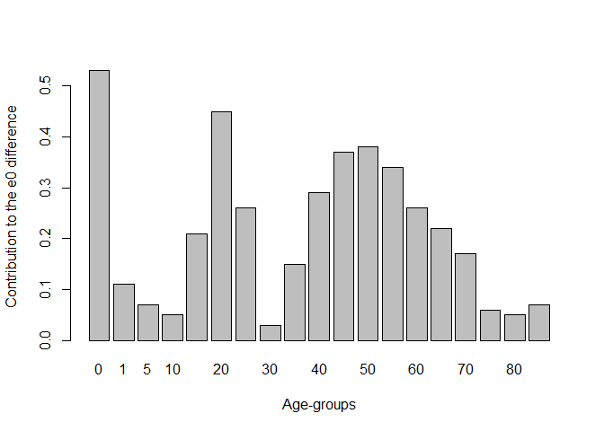

<!-- README.md is generated from README.Rmd. Please edit that file -->

# demor

<!-- badges: start -->
<!-- badges: end -->

The goal of `demor` is to provide you with: \* the most basic functions
for demographic analysis  
\* Some data

## Installation

You can install the development version of demor from
[GitHub](https://github.com/) with:

``` r

# install.packages("devtools")
devtools::install_github("vadvu/demor")
```

## Get ROSBRIS data

For getting data from
[RosBris](http://demogr.nes.ru/index.php/ru/demogr_indicat/data) there
is function `get_rosbris()` that can download data on
mortality/fertility by 1/5-year age groups from 1989 to the last
available year (in 2023 its 2022).  
Worth noting: downloading and preparing the final file can get some
time.  
In the chunk below mortality data for 5-age groups with population in
“long” format is loading. For more function description use
`?get_rosbris`

``` r
library(demor)

db <- get_rosbris(
  #mortality data
  type = "m",
  #what age group download
  age =  5,
  #to get "long" data
  initial = F,
  #last available year (the name of the downloading file contains years, so for the downloading the last year is required)
  lastyear = 2022
)
```

Lets see data for Russia in 2010 for males and for total population

``` r
db[db$year==2010 & db$code==1100 & db$sex=="m" & db$territory=="t",]
#>       year code territory sex age       mx       N        Dx
#> 20445 2010 1100         t   m   0 0.008823  869388   7670.61
#> 20446 2010 1100         t   m   1 0.000604 3222450   1946.36
#> 20447 2010 1100         t   m   5 0.000355 3613276   1282.71
#> 20448 2010 1100         t   m  10 0.000387 3398894   1315.37
#> 20449 2010 1100         t   m  15 0.001186 4353344   5163.07
#> 20450 2010 1100         t   m  20 0.002546 6193325  15768.21
#> 20451 2010 1100         t   m  25 0.004491 6002262  26956.16
#> 20452 2010 1100         t   m  30 0.006808 5395865  36735.05
#> 20453 2010 1100         t   m  35 0.007934 4973298  39458.15
#> 20454 2010 1100         t   m  40 0.009782 4464789  43674.57
#> 20455 2010 1100         t   m  45 0.013354 5140274  68643.22
#> 20456 2010 1100         t   m  50 0.018567 5207919  96695.43
#> 20457 2010 1100         t   m  55 0.026250 4333619 113757.50
#> 20458 2010 1100         t   m  60 0.037143 3117320 115786.62
#> 20459 2010 1100         t   m  65 0.049925 1573662  78565.08
#> 20460 2010 1100         t   m  70 0.068599 2149929 147482.98
#> 20461 2010 1100         t   m  75 0.097635 1077916 105242.33
#> 20462 2010 1100         t   m  80 0.138043  714191  98589.07
#> 20463 2010 1100         t   m  85 0.198593  231350  45944.49
```

Now one can create life-table based on getted data for 2010-Russia using
`LT()`

``` r
rus2010 <- db[db$year==2010 & db$code==1100 & db$sex=="m" & db$territory=="t",]

LT(
  age = rus2010$age, 
  sex = "m", 
  #age specific mortality rates
  mx = rus2010$mx)
#>       age      mx    ax      qx      lx      dx      Lx       Tx    ex
#>  [1,]   0 0.00882 0.132 0.00876 1.00000 0.00876 0.99240 63.03477 63.03
#>  [2,]   1 0.00060 0.500 0.00241 0.99124 0.00239 3.96019 62.04238 62.59
#>  [3,]   5 0.00036 0.500 0.00177 0.98885 0.00175 4.93988 58.08218 58.74
#>  [4,]  10 0.00039 0.500 0.00193 0.98710 0.00191 4.93072 53.14231 53.84
#>  [5,]  15 0.00119 0.500 0.00591 0.98519 0.00582 4.91139 48.21159 48.94
#>  [6,]  20 0.00255 0.500 0.01265 0.97937 0.01239 4.86586 43.30020 44.21
#>  [7,]  25 0.00449 0.500 0.02221 0.96698 0.02147 4.78120 38.43434 39.75
#>  [8,]  30 0.00681 0.500 0.03347 0.94550 0.03165 4.64841 33.65314 35.59
#>  [9,]  35 0.00793 0.500 0.03890 0.91386 0.03555 4.48042 29.00473 31.74
#> [10,]  40 0.00978 0.500 0.04774 0.87831 0.04193 4.28672 24.52431 27.92
#> [11,]  45 0.01335 0.500 0.06461 0.83638 0.05404 4.04679 20.23759 24.20
#> [12,]  50 0.01857 0.500 0.08872 0.78234 0.06941 3.73817 16.19080 20.70
#> [13,]  55 0.02625 0.500 0.12317 0.71293 0.08781 3.34513 12.45263 17.47
#> [14,]  60 0.03714 0.500 0.16994 0.62512 0.10623 2.86003  9.10751 14.57
#> [15,]  65 0.04992 0.500 0.22193 0.51889 0.11516 2.30657  6.24748 12.04
#> [16,]  70 0.06860 0.500 0.29278 0.40374 0.11821 1.72316  3.94091  9.76
#> [17,]  75 0.09764 0.500 0.39240 0.28553 0.11204 1.14754  2.21775  7.77
#> [18,]  80 0.13804 0.500 0.51313 0.17349 0.08902 0.64489  1.07021  6.17
#> [19,]  85 0.19859 5.035 1.00000 0.08447 0.08447 0.42532  0.42532  5.04
```

Also one can do simple decomposition between 2 populations. Lets use
Russia-2000 as base population and Russia-2010 as compared population

``` r
rus2010 <- db[db$year==2010 & db$code==1100 & db$sex=="m" & db$territory=="t",]
rus2000 <- db[db$year==2000 & db$code==1100 & db$sex=="m" & db$territory=="t",]

dec <- decomp(mx1 = rus2000$mx, 
              mx2 = rus2010$mx, 
              sex = "m", 
              age = rus2000$age, 
              method = "andreev")
dec
#>    age   ex1   ex2     lx2  dex ex12   ex12_prc
#> 1    0 58.98 63.03 1.00000 4.05 0.53 13.0221130
#> 2    1 59.04 62.59 0.99124 3.55 0.11  2.7027027
#> 3    5 55.29 58.74 0.98885 3.45 0.07  1.7199017
#> 4   10 50.45 53.84 0.98710 3.39 0.05  1.2285012
#> 5   15 45.59 48.94 0.98519 3.35 0.21  5.1597052
#> 6   20 41.05 44.21 0.97937 3.16 0.45 11.0565111
#> 7   25 37.01 39.75 0.96698 2.74 0.26  6.3882064
#> 8   30 33.06 35.59 0.94550 2.53 0.03  0.7371007
#> 9   35 29.15 31.74 0.91386 2.59 0.15  3.6855037
#> 10  40 25.40 27.92 0.87831 2.52 0.29  7.1253071
#> 11  45 21.90 24.20 0.83638 2.30 0.37  9.0909091
#> 12  50 18.71 20.70 0.78234 1.99 0.38  9.3366093
#> 13  55 15.82 17.47 0.71293 1.65 0.34  8.3538084
#> 14  60 13.24 14.57 0.62512 1.33 0.26  6.3882064
#> 15  65 10.93 12.04 0.51889 1.11 0.22  5.4054054
#> 16  70  8.88  9.76 0.40374 0.88 0.17  4.1769042
#> 17  75  7.12  7.77 0.28553 0.65 0.06  1.4742015
#> 18  80  5.47  6.17 0.17349 0.70 0.05  1.2285012
#> 19  85  4.16  5.04 0.08447 0.88 0.07  1.7199017
```


