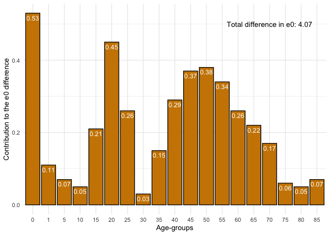
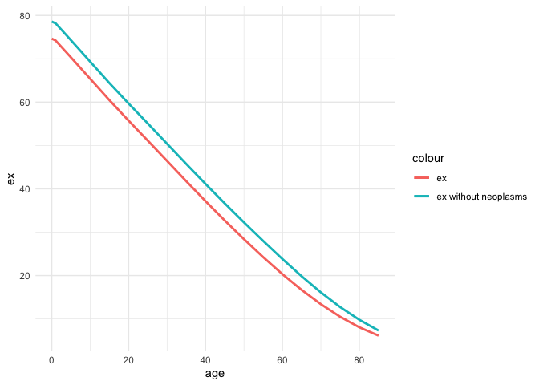
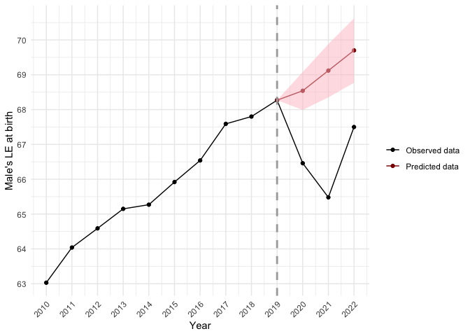
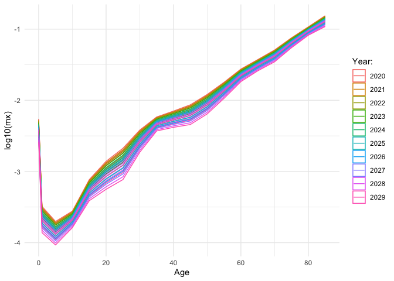
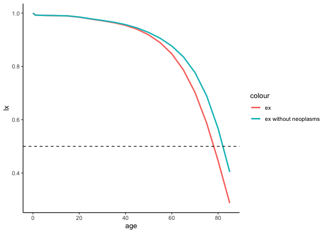
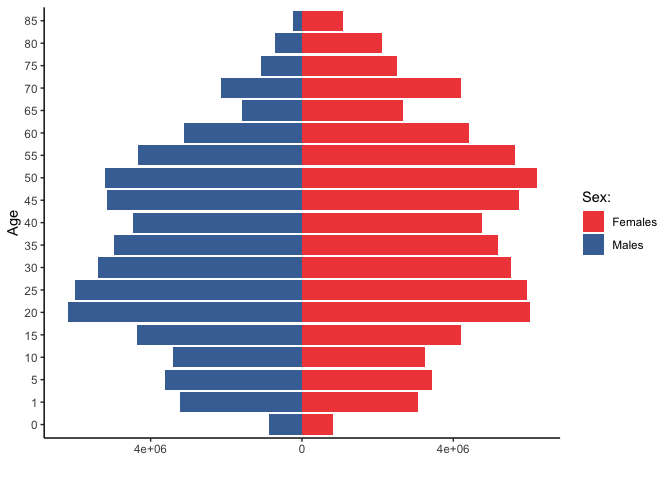
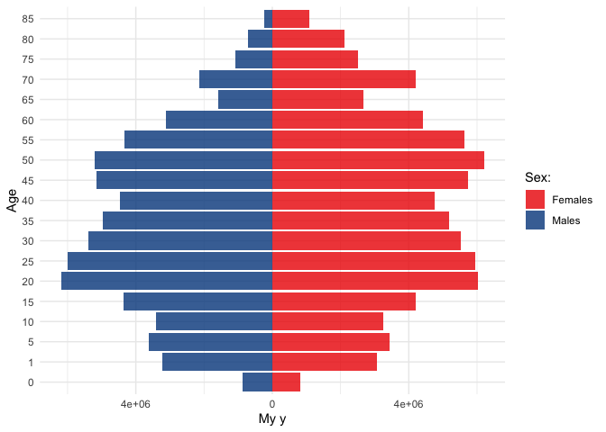

Demor package for basic demographic analysis
================

- [Installation](#installation)
- [Get Rosbris data](#get-rosbris-data)
- [Mortality](#mortality)
  - [Life table](#life-table)
  - [Human Life Indicator (HLI)](#human-life-indicator-hli)
  - [Years of Life Lost (YLL)](#years-of-life-lost-yll)
  - [Age decomposition of differences in life
    expectancies](#age-decomposition-of-differences-in-life-expectancies)
  - [Age and cause decomposition of differences in life
    expectancies](#age-and-cause-decomposition-of-differences-in-life-expectancies)
  - [Lee-Carter model](#lee-carter-model)
  - [Associated single decrement life
    table](#associated-single-decrement-life-table)
- [Fertility](#fertility)
  - [TFR](#tfr)
- [Other functions](#other-functions)
- [References](#references)

<!-- README.md is generated from README.Rmd. Please edit that file -->

The goal of `demor` is to provide you with:  
1. the most basic functions for demographic analysis  
2. some data

# Installation

You can install the development version of `demor` from
[GitHub](https://github.com/) with:

``` r

# install.packages("devtools")
devtools::install_github("vadvu/demor")
```

# Get Rosbris data

For getting data from
[RosBris](http://demogr.nes.ru/index.php/ru/demogr_indicat/data) there
is a function `get_rosbris()` that can download data on
mortality/fertility by 1/5-year age groups from 1989 to the last
available year (in 2023 its 2022).  
Worth noting: downloading and preparing the final file can get some
time.  
In the chunk below mortality data for 5-age groups with population in
“long” format is loading. For more function description use
`?get_rosbris`

``` r
library(demor)

dbm <- get_rosbris(
  #mortality data
  type = "m",
  #what age group download
  age =  5,
  #to get "long" data
  initial = F,
  #last available year (the name of the downloading file contains years, so for the downloading the last year is required)
  lastyear = 2022
)
```

Lets see the data for Russia in 2010 for males and for total population
(both urban and rural)

``` r
dbm[dbm$year==2010 & dbm$code==1100 & dbm$sex=="m" & dbm$territory=="t",]
#>       year code territory sex age       mx       N        Dx
#> 20445 2010 1100         t   m   0 0.008823  869388   7670.61
#> 20446 2010 1100         t   m   1 0.000604 3222450   1946.36
#> 20447 2010 1100         t   m   5 0.000355 3613276   1282.71
#> 20448 2010 1100         t   m  10 0.000387 3398894   1315.37
#> 20449 2010 1100         t   m  15 0.001186 4353344   5163.07
#> 20450 2010 1100         t   m  20 0.002546 6193325  15768.21
#> 20451 2010 1100         t   m  25 0.004491 6002262  26956.16
#> 20452 2010 1100         t   m  30 0.006808 5395865  36735.05
#> 20453 2010 1100         t   m  35 0.007934 4973298  39458.15
#> 20454 2010 1100         t   m  40 0.009782 4464789  43674.57
#> 20455 2010 1100         t   m  45 0.013354 5140274  68643.22
#> 20456 2010 1100         t   m  50 0.018567 5207919  96695.43
#> 20457 2010 1100         t   m  55 0.026250 4333619 113757.50
#> 20458 2010 1100         t   m  60 0.037143 3117320 115786.62
#> 20459 2010 1100         t   m  65 0.049925 1573662  78565.08
#> 20460 2010 1100         t   m  70 0.068599 2149929 147482.98
#> 20461 2010 1100         t   m  75 0.097635 1077916 105242.33
#> 20462 2010 1100         t   m  80 0.138043  714191  98589.07
#> 20463 2010 1100         t   m  85 0.198593  231350  45944.49
```

# Mortality

## Life table

Now one can create *life table* based on gotten data for 2010-Russia
using `LT()`.  
Note, $a_x$ for age 0 is modeled as in Andreev & Kingkade
([2015](https://doi.org/10.4054/DemRes.2015.33.13)).

``` r
rus2010 <- dbm[dbm$year==2010 & dbm$code==1100 & dbm$sex=="m" & dbm$territory=="t",]

LT(
  age = rus2010$age, 
  sex = "m", 
  #age specific mortality rates
  mx = rus2010$mx)
#>       age      mx    ax      qx      lx      dx      Lx       Tx    ex
#>  [1,]   0 0.00882 0.132 0.00876 1.00000 0.00876 0.99240 63.03477 63.03
#>  [2,]   1 0.00060 0.500 0.00241 0.99124 0.00239 3.96019 62.04238 62.59
#>  [3,]   5 0.00036 0.500 0.00177 0.98885 0.00175 4.93988 58.08218 58.74
#>  [4,]  10 0.00039 0.500 0.00193 0.98710 0.00191 4.93072 53.14231 53.84
#>  [5,]  15 0.00119 0.500 0.00591 0.98519 0.00582 4.91139 48.21159 48.94
#>  [6,]  20 0.00255 0.500 0.01265 0.97937 0.01239 4.86586 43.30020 44.21
#>  [7,]  25 0.00449 0.500 0.02221 0.96698 0.02147 4.78120 38.43434 39.75
#>  [8,]  30 0.00681 0.500 0.03347 0.94550 0.03165 4.64841 33.65314 35.59
#>  [9,]  35 0.00793 0.500 0.03890 0.91386 0.03555 4.48042 29.00473 31.74
#> [10,]  40 0.00978 0.500 0.04774 0.87831 0.04193 4.28672 24.52431 27.92
#> [11,]  45 0.01335 0.500 0.06461 0.83638 0.05404 4.04679 20.23759 24.20
#> [12,]  50 0.01857 0.500 0.08872 0.78234 0.06941 3.73817 16.19080 20.70
#> [13,]  55 0.02625 0.500 0.12317 0.71293 0.08781 3.34513 12.45263 17.47
#> [14,]  60 0.03714 0.500 0.16994 0.62512 0.10623 2.86003  9.10751 14.57
#> [15,]  65 0.04992 0.500 0.22193 0.51889 0.11516 2.30657  6.24748 12.04
#> [16,]  70 0.06860 0.500 0.29278 0.40374 0.11821 1.72316  3.94091  9.76
#> [17,]  75 0.09764 0.500 0.39240 0.28553 0.11204 1.14754  2.21775  7.77
#> [18,]  80 0.13804 0.500 0.51313 0.17349 0.08902 0.64489  1.07021  6.17
#> [19,]  85 0.19859 5.035 1.00000 0.08447 0.08447 0.42532  0.42532  5.04
```

Note, from life table one can compute other *functions* (not just $e_x$
or $l_x$):  
1. $CDR = \frac{1}{e_0}$ or Death rate above some age
$x: \frac{1}{e_x}$.  
2. Probability of surviving from age $x$ to age $y$:
$p=\frac{l_y}{l_x}$.  
3. Probability that a newborn will die between ages $x$ and $x+n$:
$\frac{d_x^n}{l_0}$.  
4. Probability that a newborn will die between ages $x$ and $y$:
$\frac{l_x-l_y}{l_0}$.  
5. Life course ratio from age $x$ to $y$ that is the fraction of
person-years lived from age $x$ onward: $\frac{T_y}{T_x}$.

## Human Life Indicator (HLI)

A good alternative to the *human development indicator* (HDI) is the
*human life indicator* (HLI) proposed by Ghislandi, Sanderson and
Scherbov ([2019](https://doi.org/10.1111/padr.12205)). It requires just
$m_x$ (and it is based on *life table*). It is calculated as geometric
mean of lifespans: $$HLI = \prod_x^\omega{(x+a_x)^{d_x}}$$ where *x* is
age and *a*, *d* are functions from *life table*.

Lets calculate it using our example data:

``` r
hli(
  age = rus2010$age, 
  sex = "m", 
  mx = rus2010$mx)
#> [1] 55.19236
```

## Years of Life Lost (YLL)

One of the most popular (and relatively young) measure of *lifespan
inequality* is “*years of life lost*” (YLL) proposed by Martinez et
al. ([2019](https://doi.org/10.1093/ije/dyy254)). As authors claim, “YLL
is a valuable measure for public health surveillance, particularly for
quantifying the level and trends of premature mortality, identification
of leading causes of premature deaths and monitoring the progress of YLL
as a key indicator of population health” (ibid., 1368).

Authors proposed different metrics of *YLL*:  
1. Absolute number of *YLL*: $$YLL_{x,t,c}=D_{x,t,c}*SLE_x$$ that is
calculated for age *x*, time *t* and cause of death *c*. *YLL* for the
whole population is just sum of $YLL_x$. *SLE* is the *standard life
expectancy* that is invariant over time, sex and population (it’s
meaning is straightforward: it is the potential maximum life span of an
individual, who is not exposed to avoidable health risks or severe
injuries and receives appropriate health services), and $D_x$ is a
number of deaths at age *x*. Of course, one can calculate *YLL* not for
specific cause *c*, but for overall mortality that is called *all-causes
YLL*.  
2. *YLL* as proportion: $$YLL^p_{x,t,c}=YLL_{x,t,c}/YLL_{x,t}$$ that is
just *cause specific YLL* divided by *all-causes YLL*.  
3. *YLL* rate: $$YLL^r_{x,t,c}=[YLL_{x,t,c}/P_{x,t}] * 100'000$$ where
$P_{x,t}$ is population.  
4. Age-standardized *YLL* rate:
$$ASYR_{x,t,c} = \sum_x^\omega{[YLL^r_{x,t,c}*W_x]}$$ where $W_x$ is the
standard population weight at age *x*, where $\omega$ is the oldest,
closing age (for ex., 85+ or 100+). In other words, it’s just direct
standardization of $YLL^r_{x,t,c}$.

Let’s calculate all-cause *YLL*, *Yll rate* and *ASYR* using Rosbris
data that we have downloaded.

``` r
#YLL
yll(rus2010$Dx, type = "yll")
#> $yll_all
#> [1] 33640561
#> 
#> $yll
#>  [1]  705159.2  174024.0  108414.6  104611.4  384855.2 1096994.4 1741367.9
#>  [8] 2190511.0 2157177.1 2171936.4 3075902.7 3860081.6 3989475.5 3502545.3
#> [15] 2002623.9 3063221.5 1729131.5 1233349.3  349178.1
```

``` r
#YLL rate
yll(rus2010$Dx, type = "yll.r", pop = rus2010$N)
#> $yll.r_all
#> [1] 50945.02
#> 
#> $yll.r
#>  [1]  81109.836   5400.365   3000.453   3077.806   8840.451  17712.527
#>  [7]  29011.861  40596.105  43375.182  48645.890  59839.275  74119.462
#> [13]  92058.751 112357.578 127258.833 142480.124 160414.307 172691.796
#> [19] 150930.678
```

For *ASYR* one needs standard population. Let’s use 2010 population as
standard (note, in this case *ASYR* equals *YLL rate* because we use
2010 mortality).

``` r
#ASYR
yll(rus2010$Dx, type = "asyr", pop = rus2010$N, w = rus2010$N/sum(rus2010$N))
#> $asyr
#>  [1] 1067.8879  263.5407  164.1824  158.4227  582.8220 1661.2803 2637.1149
#>  [8] 3317.2939 3266.8132 3289.1646 4658.1245 5845.6793 6041.6326 5304.2289
#> [15] 3032.7590 4638.9202 2618.5841 1867.7751  528.7928
#> 
#> $asyr_all
#> [1] 50945.02
```

Also one can calculate different *YLL* measures using standards that are
provided by `demor` as dataframe.

``` r
demor::sle_stand
```

## Age decomposition of differences in life expectancies

Also one can do simple *decomposition* between 2 populations. Lets use
Russia-2000 as *base population* and Russia-2010 as *compared
population*

``` r
rus2010 <- dbm[dbm$year==2010 & dbm$code==1100 & dbm$sex=="m" & dbm$territory=="t",]
rus2000 <- dbm[dbm$year==2000 & dbm$code==1100 & dbm$sex=="m" & dbm$territory=="t",]

dec <- decomp(mx1 = rus2000$mx, 
              mx2 = rus2010$mx, 
              sex = "m", 
              age = rus2000$age, 
              method = "andreev")
dec
#>    age   ex1   ex2     lx2  dex ex12   ex12_prc
#> 1    0 58.98 63.03 1.00000 4.05 0.53 13.0221130
#> 2    1 59.04 62.59 0.99124 3.55 0.11  2.7027027
#> 3    5 55.29 58.74 0.98885 3.45 0.07  1.7199017
#> 4   10 50.45 53.84 0.98710 3.39 0.05  1.2285012
#> 5   15 45.59 48.94 0.98519 3.35 0.21  5.1597052
#> 6   20 41.05 44.21 0.97937 3.16 0.45 11.0565111
#> 7   25 37.01 39.75 0.96698 2.74 0.26  6.3882064
#> 8   30 33.06 35.59 0.94550 2.53 0.03  0.7371007
#> 9   35 29.15 31.74 0.91386 2.59 0.15  3.6855037
#> 10  40 25.40 27.92 0.87831 2.52 0.29  7.1253071
#> 11  45 21.90 24.20 0.83638 2.30 0.37  9.0909091
#> 12  50 18.71 20.70 0.78234 1.99 0.38  9.3366093
#> 13  55 15.82 17.47 0.71293 1.65 0.34  8.3538084
#> 14  60 13.24 14.57 0.62512 1.33 0.26  6.3882064
#> 15  65 10.93 12.04 0.51889 1.11 0.22  5.4054054
#> 16  70  8.88  9.76 0.40374 0.88 0.17  4.1769042
#> 17  75  7.12  7.77 0.28553 0.65 0.06  1.4742015
#> 18  80  5.47  6.17 0.17349 0.70 0.05  1.2285012
#> 19  85  4.16  5.04 0.08447 0.88 0.07  1.7199017
```

Than let us plot the result of `decomp` using R basic plot.

``` r
barplot(height=dec$ex12, 
        names=dec$age,
        xlab="Age-groups", 
        ylab="Сontribution to the e0 difference")
```


Or using `ggplot2`

``` r
library(ggplot2)

ggplot(dec, aes( as.factor(age), ex12))+
  geom_bar(stat = "identity", color = "black", fill = "orange3")+
  theme_minimal()+
  labs(x = "Age-groups", 
       y = "Сontribution to the e0 difference")+
  annotate("text", x = "70", y = 0.5, label = paste0("Total difference in e0: ", sum(dec$ex12)))+
  geom_text(aes(label = ex12), vjust = 1.5, color = "white", size = 3.5)
```



## Age and cause decomposition of differences in life expectancies

Also one can do *decomposition* between 2 populations by *age* and
*causes*. Lets use example from Andreev & Shkolnikov
[spreadsheet](https://www.demogr.mpg.de/en/publications_databases_6118/publications_1904/mpidr_technical_reports/an_excel_spreadsheet_for_the_decomposition_of_a_difference_between_two_values_of_an_aggregate_demographic_4591)
where data for US and England and Wales men mortality by some causes are
presented.  
Lets see the data

``` r
data("mdecompex")
head(mdecompex)
#> # A tibble: 6 × 9
#>     age neoplasms circulatory respiratory  digestive  accident     other     all
#>   <dbl>     <dbl>       <dbl>       <dbl>      <dbl>     <dbl>     <dbl>   <dbl>
#> 1     0 0.0000349  0.000173    0.000188   0.000151   0.000377  0.00669   7.62e-3
#> 2     1 0.0000309  0.0000155   0.0000220  0.00000930 0.000163  0.000112  3.53e-4
#> 3     5 0.0000313  0.00000560  0.00000687 0.00000324 0.0000792 0.0000409 1.67e-4
#> 4    10 0.0000305  0.0000127   0.00000896 0.00000286 0.000127  0.0000490 2.31e-4
#> 5    15 0.0000424  0.0000322   0.0000141  0.00000401 0.000765  0.0000821 9.40e-4
#> 6    20 0.0000600  0.0000511   0.0000158  0.00000928 0.00114   0.000130  1.41e-3
#> # ℹ 1 more variable: cnt <chr>
```

For `mdecomp` 2 lists with arrays for 2 population are required.

``` r
#US men
mx1 <- list(all = mdecompex[mdecompex$cnt=="usa",]$all, 
            neoplasm = mdecompex[mdecompex$cnt=="usa",]$neoplasms, 
            circulatory = mdecompex[mdecompex$cnt=="usa",]$circulatory, 
            respiratory = mdecompex[mdecompex$cnt=="usa",]$respiratory,
            digestive = mdecompex[mdecompex$cnt=="usa",]$digestive,
            accident = mdecompex[mdecompex$cnt=="usa",]$accident,
            other = mdecompex[mdecompex$cnt=="usa",]$other)
#England and Wales men
mx2 <- list(all = mdecompex[mdecompex$cnt=="eng",]$all, 
            neoplasm = mdecompex[mdecompex$cnt=="eng",]$neoplasms, 
            circulatory = mdecompex[mdecompex$cnt=="eng",]$circulatory, 
            respiratory = mdecompex[mdecompex$cnt=="eng",]$respiratory,
            digestive = mdecompex[mdecompex$cnt=="eng",]$digestive,
            accident = mdecompex[mdecompex$cnt=="eng",]$accident,
            other = mdecompex[mdecompex$cnt=="eng",]$other)

decm <- mdecomp(mx1 = mx1, 
              mx2 = mx2, 
              sex = "m", 
              age = unique(mdecompex$age)
              )
head(decm)
#>   age ex12      neoplasm  circulatory   respiratory     digestive   accident
#> 1   0 0.12  0.0008745885 6.544742e-03  0.0038965543  6.616401e-03 0.02107294
#> 2   1 0.03 -0.0025030458 5.483996e-04  0.0020247182  6.245908e-04 0.03637029
#> 3   5 0.02 -0.0016468368 8.262058e-05 -0.0001300012  9.929857e-05 0.02178479
#> 4  10 0.01 -0.0014084238 4.993427e-04 -0.0002451017  8.338450e-05 0.01117647
#> 5  15 0.13 -0.0032690840 2.657675e-03  0.0005053688 -2.052103e-04 0.13796276
#> 6  20 0.17 -0.0009648903 2.773336e-03 -0.0016773417 -8.983808e-04 0.18353643
#>           other
#> 1  0.0809947781
#> 2 -0.0070649563
#> 3 -0.0001898743
#> 4 -0.0001056675
#> 5 -0.0076515085
#> 6 -0.0127691565
```

Than let us plot the result of `mdecomp` using
[ggplot2](https://github.com/tidyverse/ggplot2). This requires some data
transformations

``` r
library(ggplot2)

decm_plot <- decm[,c(1,3)]
decm_plot$group = colnames(decm)[3]
colnames(decm_plot)[2]<-"ex12"
for(i in 4:ncol(decm)){
  decm_plot_i <- decm[,c(1,i)]
  decm_plot_i$group = colnames(decm)[i]
  colnames(decm_plot_i)[2]<-"ex12"
  decm_plot <- rbind(decm_plot,decm_plot_i)
  rm(decm_plot_i)
}

for (i in unique(decm_plot$group)){
  decm_plot[decm_plot$group==i,]$group <- paste0(i, " (", round(sum(decm_plot[decm_plot$group==i,]$ex12),2), ")")
}

ggplot(data = decm_plot, aes(x = as.factor(age), y = ex12, fill = group))+
  geom_bar(stat="identity", colour = "black")+
  theme_minimal()+
  scale_fill_brewer(palette="Set1")+
  labs(x = "Age", y = "Contribution to difference in ex", fill = "Cause (contribution):", 
       caption  = paste0("Total difference in ex = ", sum(decm[,2]))
       )
```



## Lee-Carter model

Also in the `demor` there is `leecart()` function that provides users
with basic *Lee-Carter model* (proposed by Lee and Carter in 1992 and
that now has a lot of extensions) for mortality forecasting:

``` r
leecart_forecast <- leecart(data = dbm[dbm$code==1100 & dbm$territory=="t" & dbm$sex=="m" & dbm$year %in% 2004:2019,c("year", "age", "mx")], 
                            n = 10, 
                            sex = "m", 
                            concise = T
                            )
head(leecart_forecast)
#>   year age           mx     mx_low95    mx_high95    ex ex_low95 ex_high95
#> 1 2020   0 0.0052050868 0.0049297552 0.0054957958 68.54    67.99     69.08
#> 2 2020   1 0.0003032973 0.0002852915 0.0003224396 67.89    67.36     68.42
#> 3 2020  10 0.0002669130 0.0002568045 0.0002774194 63.97    63.45     64.50
#> 4 2020  15 0.0007304609 0.0006953816 0.0007673099 59.06    58.53     59.58
#> 5 2020  20 0.0013011257 0.0012188971 0.0013889016 54.26    53.75     54.78
#> 6 2020  25 0.0019688556 0.0018300568 0.0021181815 49.60    49.10     50.10
```

One can plot the results using
[ggplot2](https://github.com/tidyverse/ggplot2):

``` r
ggplot(data = leecart_forecast[leecart_forecast$age=="0",], aes(year, ex))+
  geom_line()+geom_ribbon(aes(ymin = ex_low95, ymax = ex_high95), alpha = 0.3, fill = "red")+
  theme_classic()+
  scale_x_continuous(breaks = seq(2020, 2030, 2))
```



``` r


ggplot(data = leecart_forecast, aes(as.numeric(age), log10(mx), color = as.factor(year)))+
  geom_line()+geom_ribbon(aes(ymin = log10(mx_low95), ymax = log10(mx_high95)), alpha = 0)+
  theme_minimal()+
  labs(x = "Age", color = "Year:")
```



## Associated single decrement life table

There is `asdt()` function that calculates *associated single decrement
life table* (ASDT) for causes of death (*cause-deleted life table*). In
other words, by this function one can answer the question “what will be
the life expectancy if there is no mortality from cause i?”  
For example in the `demor` data (as it is easy to guess, taken from
Andreev & Shkolnikov
[spreadsheet](https://www.demogr.mpg.de/en/publications_databases_6118/publications_1904/mpidr_technical_reports/an_excel_spreadsheet_for_the_decomposition_of_a_difference_between_two_values_of_an_aggregate_demographic_4591))
on mortality of US men in 2002 by some causes is added. Let me show what
would be $e_x$ if there is no deaths from neoplasm (i)

``` r
data("asdtex")

asdt_neoplasm <- asdt(age = asdtex$age, 
                      sex = "m",
                      m_all = asdtex$all, 
                      m_i = asdtex$neoplasms, 
                      full = F, 
                      method = "chiang1968")
asdt_neoplasm[,c("age", "ex", "ex_without_i")]
#>    age    ex ex_without_i
#> 1    0 74.65        78.58
#> 2    1 74.22        78.18
#> 3    5 70.32        74.28
#> 4   10 65.38        69.33
#> 5   15 60.45        64.39
#> 6   20 55.72        59.67
#> 7   25 51.10        55.06
#> 8   30 46.43        50.39
#> 9   35 41.75        45.72
#> 10  40 37.16        41.13
#> 11  45 32.70        36.64
#> 12  50 28.39        32.26
#> 13  55 24.25        27.98
#> 14  60 20.32        23.82
#> 15  65 16.69        19.84
#> 16  70 13.40        16.12
#> 17  75 10.51        12.75
#> 18  80  8.07         9.81
#> 19  85  6.15         7.32
```

One can plot the results using
[ggplot2](https://github.com/tidyverse/ggplot2):

``` r
library(ggplot2)

ggplot(data = asdt_neoplasm, aes(x = age))+
  geom_line(aes(y = ex, color = "ex"), size = 1)+
  geom_line(aes(y = ex_without_i, color = "ex without neoplasms"), size = 1)+
  theme_minimal()
```


``` r

ggplot(data = asdt_neoplasm, aes(x = age))+
  geom_line(aes(y = lx, color = "ex"), size = 1)+
  geom_line(aes(y = l_not_i, color = "ex without neoplasms"), size = 1)+
  geom_hline(yintercept = 0.5, linetype = "dashed")+
  theme_classic()
```



# Fertility

For the analysis of fertility in the `demor` there are only a few (1…)
functions, due to the author’s preference for mortality analysis…

## TFR

Lets get basic *fertility data* (asFR or $f_x$) from
[RosBris](http://demogr.nes.ru/index.php/ru/demogr_indicat/data) using
`get_rosbris()`

``` r
dbf <- get_rosbris(
  #fertility data
  type = "f",
  #what age group download
  age =  5,
  #to get "long" data
  initial = F,
  #last available year
  lastyear = 2022
)
```

For the example Russia-2010 is gotten

``` r
rus2010f <- dbf[dbf$year==2010 & dbf$code==1100 & dbf$territory=="t",]
rus2010f
#>      year code territory age       fx       N        Bx
#> 3153 2010 1100         t  15 0.027015 4214250 113847.96
#> 3154 2010 1100         t  20 0.087421 6027079 526893.27
#> 3155 2010 1100         t  25 0.099061 5957982 590203.65
#> 3156 2010 1100         t  30 0.067240 5515957 370892.95
#> 3157 2010 1100         t  35 0.029922 5187670 155225.46
#> 3158 2010 1100         t  40 0.005904 4764028  28126.82
#> 3159 2010 1100         t  45 0.000257 5738736   1474.86
#> 3160 2010 1100         t  50 0.000014 6203597     86.85
```

Now one can compute *TFR*:

``` r
tfr(
  #asFR
  rus2010f$fx,
  #age interval
  age.int = 5
    )
#> [1] 1.58417
```

# Other functions

Also in the `demor` there are some additional functions.  
One of them is `plot_pyr` that plots population pyramid using
[ggplot2](https://github.com/tidyverse/ggplot2)  
Lets create population pyramid using midyear population from Rosbris
mortality data. We already have data in `dbm`.

``` r
plot_pyr(
  popm = dbm[dbm$year==2010 & dbm$code==1100 & dbm$territory=="t" & dbm$sex=="m",]$N,
  popf = dbm[dbm$year==2010 & dbm$code==1100 & dbm$territory=="t" & dbm$sex=="f",]$N, 
  ages = dbm[dbm$year==2010 & dbm$code==1100 & dbm$territory=="t" & dbm$sex=="f",]$age)
```



Also one can redesigned plot using
[ggplot2](https://github.com/tidyverse/ggplot2) functions:

``` r
plot <- 
  plot_pyr(
  popm = dbm[dbm$year==2010 & dbm$code==1100 & dbm$territory=="t" & dbm$sex=="m",]$N,
  popf = dbm[dbm$year==2010 & dbm$code==1100 & dbm$territory=="t" & dbm$sex=="f",]$N, 
  ages = dbm[dbm$year==2010 & dbm$code==1100 & dbm$territory=="t" & dbm$sex=="f",]$age)

plot + 
  labs(y = "My y", x = "Age")+
  theme_minimal()
```



# References

- Center for Demographic Research (2023). *Russian Fertility and
  Mortality Database (Rosbris)*.
  [URL](http://www.demogr.nes.ru/en/demogr_indicat/data)  
- Andreev, E. M., & Kingkade, W. W. (2015). Average age at death in
  infancy and infant mortality level: Reconsidering the Coale-Demeny
  formulas at current levels of low mortality. *Demographic Research*,
  *33*, 363-390.  
- Ghislandi, S., Sanderson, W. C., & Scherbov, S. (2019). A simple
  measure of human development: The human life indicator. *Population
  and development review*, *45*(*1*), 219-233.  
- Andreev, E. M., & Shkolnikov, V. M. (2012). *An Excel spreadsheet for
  the decomposition of a difference between two values of an aggregate
  demographic measure by stepwise replacement running from young to old
  ages*. MPIDR Technical Report TR-2012-002.
  [URL](https://www.demogr.mpg.de/en/publications_databases_6118/publications_1904/mpidr_technical_reports/an_excel_spreadsheet_for_the_decomposition_of_a_difference_between_two_values_of_an_aggregate_demographic_4591)  
- Lee, R. D., & Carter, L. R. (1992). Modeling and forecasting US
  mortality. *Journal of the American statistical association*,
  *87*(*419*), 659-671.
