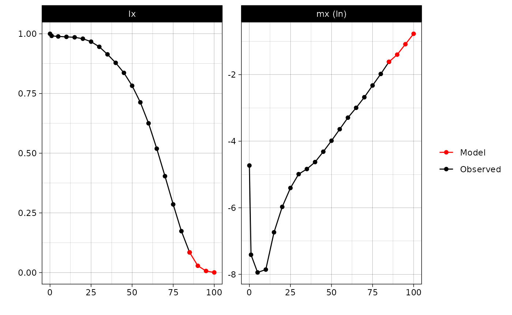
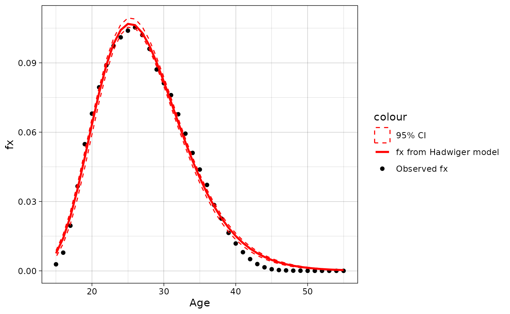
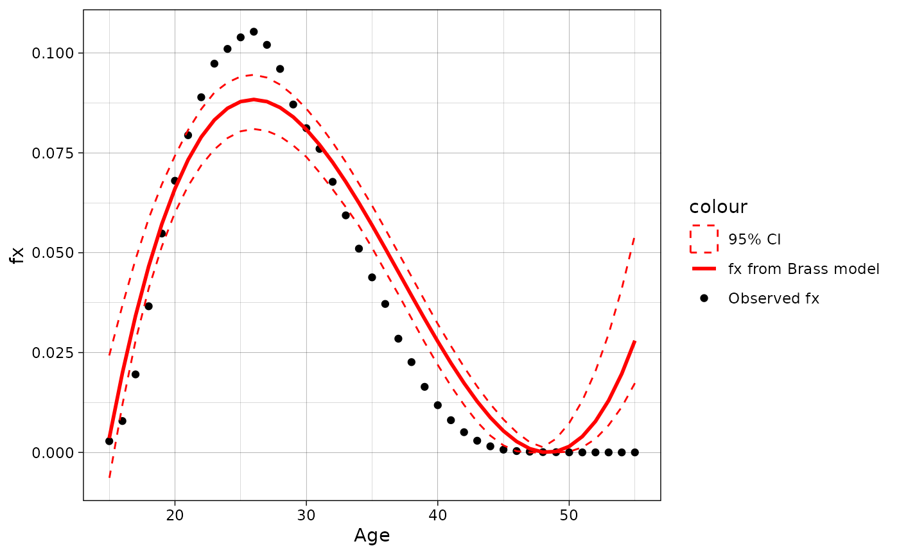
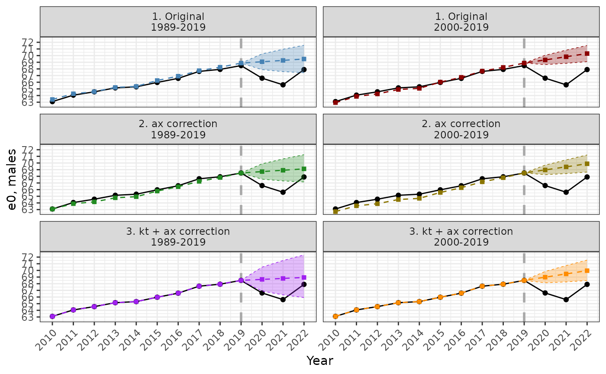
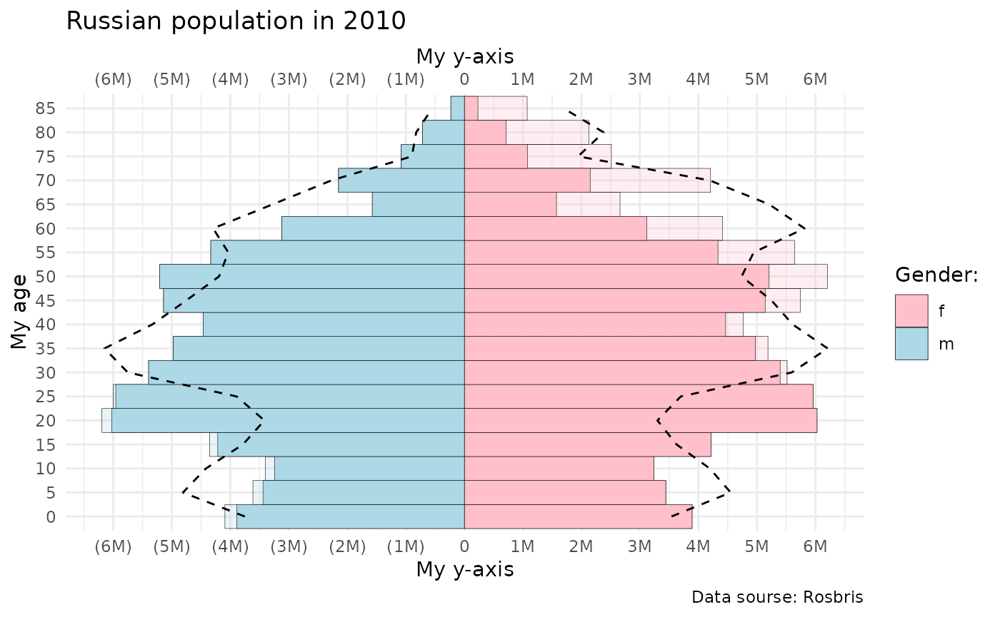

# Get started with \`demor\`

## Installation

You can install the development version of `demor` from
[GitHub](https://github.com/) with:

``` r
# install.packages("devtools")
devtools::install_github("vadvu/demor")
```

## Get Rosbris data

The data from “The Russian Fertility and Mortality database”
([2024](#ref-rosbris)) is presented in the `demor` as datasets in the
long-format (mortality/fertility by 1/5-year age groups from 1989 to
2022).  

The example of usage is placed below, where data on mortality by 5-year
age groups is presented:

``` r
dbm <- demor::rosbris_mortality_pop_5

# for 1-year age interval
# dbm <- demor::rosbris_mortality_pop_1
```

Lets see the data for Russia in 2010 for males and for total population
(both urban and rural)

``` r
dbm[dbm$year==2010 & dbm$code==1100 & dbm$sex=="m" & dbm$territory=="t",]
#>       year code territory sex age       mx       N        Dx
#> 20445 2010 1100         t   m   0 0.008823  869388   7670.61
#> 20446 2010 1100         t   m   1 0.000604 3222450   1946.36
#> 20447 2010 1100         t   m   5 0.000355 3613276   1282.71
#> 20448 2010 1100         t   m  10 0.000387 3398894   1315.37
#> 20449 2010 1100         t   m  15 0.001186 4353344   5163.07
#> 20450 2010 1100         t   m  20 0.002546 6193325  15768.21
#> 20451 2010 1100         t   m  25 0.004491 6002262  26956.16
#> 20452 2010 1100         t   m  30 0.006808 5395865  36735.05
#> 20453 2010 1100         t   m  35 0.007934 4973298  39458.15
#> 20454 2010 1100         t   m  40 0.009782 4464789  43674.57
#> 20455 2010 1100         t   m  45 0.013354 5140274  68643.22
#> 20456 2010 1100         t   m  50 0.018567 5207919  96695.43
#> 20457 2010 1100         t   m  55 0.026250 4333619 113757.50
#> 20458 2010 1100         t   m  60 0.037143 3117320 115786.62
#> 20459 2010 1100         t   m  65 0.049925 1573662  78565.08
#> 20460 2010 1100         t   m  70 0.068599 2149929 147482.98
#> 20461 2010 1100         t   m  75 0.097635 1077916 105242.33
#> 20462 2010 1100         t   m  80 0.138043  714191  98589.07
#> 20463 2010 1100         t   m  85 0.198593  231350  45944.49
#>                       name
#> 20445 Российская Федерация
#> 20446 Российская Федерация
#> 20447 Российская Федерация
#> 20448 Российская Федерация
#> 20449 Российская Федерация
#> 20450 Российская Федерация
#> 20451 Российская Федерация
#> 20452 Российская Федерация
#> 20453 Российская Федерация
#> 20454 Российская Федерация
#> 20455 Российская Федерация
#> 20456 Российская Федерация
#> 20457 Российская Федерация
#> 20458 Российская Федерация
#> 20459 Российская Федерация
#> 20460 Российская Федерация
#> 20461 Российская Федерация
#> 20462 Российская Федерация
#> 20463 Российская Федерация
```

## Mortality

### Life table

Now one can create *life table* based on gotten data for 2010-Russia
using [`LT()`](https://vadvu.github.io/demor/reference/LT.md).  
Note, $a_{x}$ for age 0 is modeled as in Evgeny M. Andreev and Kingkade
([2015](#ref-Andreev_ax)), while the function can use user-specific
$a_{x}$ from the argument `ax`. However, despite there is a plethora of
methods to construct life table that “are based upon very different
assumptions, when applied to actual mortality rates they do not result
in significant differences of importance to mortality analysis.” (WHO,
1977, p. 70, cite from [Preston, Heuveline, and Guillot 2001,
47](#ref-preston)). For example, changing $a_{0}$ to 0.5 only increases
the life expectancy $e_{0}$ by $\approx + 0.01$ for the 2010 Russian
male population, which is about 4 days when applied to human life span.

``` r
rus2010 <- dbm[dbm$year==2010 & dbm$code==1100 & dbm$sex=="m" & dbm$territory=="t",]

LT(
  age = rus2010$age, 
  sex = "m", 
  mx = rus2010$mx #age specific mortality rates (mx)
  )
#>       age      mx    ax      qx      lx      dx      Lx       Tx    ex
#>  [1,]   0 0.00882 0.132 0.00876 1.00000 0.00876 0.99885 63.04122 63.04
#>  [2,]   1 0.00060 2.000 0.00241 0.99124 0.00239 3.96019 62.04238 62.59
#>  [3,]   5 0.00036 2.500 0.00177 0.98885 0.00175 4.93988 58.08218 58.74
#>  [4,]  10 0.00039 2.500 0.00193 0.98710 0.00191 4.93072 53.14231 53.84
#>  [5,]  15 0.00119 2.500 0.00591 0.98519 0.00582 4.91139 48.21159 48.94
#>  [6,]  20 0.00255 2.500 0.01265 0.97937 0.01239 4.86586 43.30020 44.21
#>  [7,]  25 0.00449 2.500 0.02221 0.96698 0.02147 4.78120 38.43434 39.75
#>  [8,]  30 0.00681 2.500 0.03347 0.94550 0.03165 4.64841 33.65314 35.59
#>  [9,]  35 0.00793 2.500 0.03890 0.91386 0.03555 4.48042 29.00473 31.74
#> [10,]  40 0.00978 2.500 0.04774 0.87831 0.04193 4.28672 24.52431 27.92
#> [11,]  45 0.01335 2.500 0.06461 0.83638 0.05404 4.04679 20.23759 24.20
#> [12,]  50 0.01857 2.500 0.08872 0.78234 0.06941 3.73817 16.19080 20.70
#> [13,]  55 0.02625 2.500 0.12317 0.71293 0.08781 3.34513 12.45263 17.47
#> [14,]  60 0.03714 2.500 0.16994 0.62512 0.10623 2.86003  9.10751 14.57
#> [15,]  65 0.04992 2.500 0.22193 0.51889 0.11516 2.30657  6.24748 12.04
#> [16,]  70 0.06860 2.500 0.29278 0.40374 0.11821 1.72316  3.94091  9.76
#> [17,]  75 0.09764 2.500 0.39240 0.28553 0.11204 1.14754  2.21775  7.77
#> [18,]  80 0.13804 2.500 0.51313 0.17349 0.08902 0.64489  1.07021  6.17
#> [19,]  85 0.19859 5.035 1.00000 0.08447 0.08447 0.42532  0.42532  5.04
```

Note, from life table one can compute other *functions* (not just
$e_{x}$) and quantities of interest:

1.  Crude death rate $CDR = 1/e_{0} = \sum_{x}D_{x}/\sum_{x}N_{x}$ or
    death rate above some age $x:1/e_{x}$
2.  Probability of surviving from age $x$ to age $y$:
    $p(x,y) = l_{y}/l_{x} \approx exp\left( - m_{x} \times n \right)$
3.  Probability that a newborn will die between ages $x$ and $x + n$:
    $d_{x}^{n}/l_{0}$
4.  Probability that a newborn will die between ages $x$ and $y$:
    $\left( l_{x} - l_{y} \right)/l_{0}$
5.  Probability that a newborn will survive to age $x$:
    $p(x) = l_{x}/l_{0}$
6.  Probability that a newborn will die in age $x$: $q(x) = 1 - p_{x}$
7.  Life course ratio from age $x$ to $y$ that is the fraction of
    person-years lived from age $x$ onward: $T_{y}/T_{x}$
8.  Crude estimate of the number of births needed to “replace” expected
    deaths: $P/e_{0}$ where $P$ is total population

See also Preston, Heuveline, and Guillot ([2001](#ref-preston)).

The life table is the one of the most important demographic tools that
can be used not only for mortality, but for any other decrement
processes (for ex., marital, occupation, migration status and etc).

### Human Life Indicator (HLI)

A good alternative to the *human development indicator* (HDI) is the
*human life indicator* (HLI) proposed by Ghislandi, Sanderson, and
Scherbov ([2019](#ref-hli)). It requires just $m_{x}$ (and it is based
on *life table*). It is calculated as geometric mean of lifespans:
$$HLI = \prod\limits_{x}^{\omega}\left( x + a_{x} \right)^{d_{x}}$$
where $x$ is age and $a_{x}$, $d_{x}$ are functions from *life table*
that corresponds to age $x$.

Calculation in the `demor` is as follows (one need only $m_{x}$):

``` r

hli(
  age = rus2010$age, 
  mx = rus2010$mx,
  sex = "m"
  )
#> [1] 57.18468
```

### Gini coefficient

As Shkolnikov, Andreev, and Begun ([2003](#ref-Shkolnikov_gini)) note,
“at present, the average level of life expectancy is high in many
countries and it is interesting to study to what extent this advantage
is equally accessible to all people”. (p. 306). One of the tools for
analysing mortality inequality within the population (or, rather, the
life table) is the Gini index, which is similar to the “usual” index
widely used in economics. Life table Gini, $G_{0}$, shows a degree of
inter-individual variability in age at death and can be interpreted as
in other fields ($G_{0} \in \lbrack 0,1\rbrack$; higher $G_{0}$, higher
inequality and vice versa). Also one can be interested in “absolute”
Gini coefficient (aka AID - Absolute Inter-individual Difference) that
is $G_{0}^{abs} = G_{0} \times e_{0}$ which “is equal to the average
inter-individual difference in length of life and is measured in years.”
([Shkolnikov, Andreev, and Begun 2003, 312](#ref-Shkolnikov_gini))

Below is the function `gini` that computes Gini index as well as
produces data for Lorenz curve - the graphical representation of
inequality. The formulas for the calculations are derived from
Shkolnikov, Andreev, and Begun ([2003](#ref-Shkolnikov_gini)) (that is
based on the Hanada ([1983](#ref-hanada_gini)) formulation).

``` r
dbm.1 <- demor::rosbris_mortality_pop_1
mx <- dbm.1[dbm.1$code==1100 & dbm.1$territory=="t" & dbm.1$sex=="f" & dbm.1$year == 1995,]$mx
res = gini(age = 0:100, mx = mx, sex = "f")
res$Gini
#> $G0
#>        ex 
#> 0.1295455 
#> 
#> $G0_abs
#>      ex 
#> 9.27805
```

Note, in Shkolnikov, Andreev, and Begun ([2003](#ref-Shkolnikov_gini))
the $G_{0} = 0.13$ (see p. 310, figure 1), while using `gini` one
obtains 0.1295. Also note that the larger the age interval, the less
accurate the estimate will be, since it is based on a discrete
approximation of a continuous function.

Below is an example of Lorenz curve that can be created using ggplot2
and `gini` output.

``` r

res$plot %>% 
  ggplot(aes(Fx, Phix))+
  geom_line(color = "red")+
  geom_abline(intercept = 0, slope = 1)+
  scale_x_continuous(limits=c(0,1), expand = c(0, 0)) +
  scale_y_continuous(limits=c(0,1),expand = c(0, 0)) +
  theme_classic()+
  labs(x = "Proportion in population", y = "Proportion in person-years of life")+
  ggtitle("Lorenz curve: Russia, 1995, females", 
          subtitle = paste0("G0 = ", round(res$Gini$G0, 2), ", ", 
                            "G0 abs = ", round(res$Gini$G0_abs, 2), ", ",
                            "e0 = ", round(res$Gini$G0_abs/res$Gini$G0, 2))
          )
```


Note, one can calculate not only Gini *inequality* index, but also
Drewnowski’s index of *equality* that is $D_{0} = 1 - G_{0}$ proposed by
Aburto et al. ([2022](#ref-Drewnowski)) (so, for Russian 1995 females it
is $1 - 0.13 = 0.87$) that also can serve as an indicator of the shape
of mortality patterns.

### e-dagger

Another measure of mortality inequality is “e-dagger”,
$e_{x}^{\dagger}$, proposed by Vaupel and Romo ([2003](#ref-edagger)),
that is approximation of “the average life expectancy lost because of
death” ([Vaupel and Romo 2003, 206](#ref-edagger)).

In `demor` there is a function `edagger` for calculation “e-dagger” for
age $x$, $e_{x}^{\dagger}$:

``` r

mx <- dbm.1[dbm.1$code==1100 & dbm.1$territory=="t" & dbm.1$sex=="f" & dbm.1$year == 1995,]$mx
res = edagger(age = 0:100, mx = mx, sex = "f")
res[c(1, 26, 51, 76)]
#>         0        25        50        75 
#> 12.719536 10.968361  9.137110  5.201578
```

Hence, $e_{0}^{\dagger}$ for Russian female population in 1995 is 12.72.
From $e_{x}^{\dagger}$ one can also calculate life table entropy
$H_{x}$(see, for ex., [Wrycza, Missov, and Baudisch
2015](#ref-comp_ineq2)) that is simply $H_{x} = e_{x}^{\dagger}/e_{x}$.
Usually only one quantity as entropy is presented that is $H_{0}$, which
sometimes is denoted as $\bar{H}$, and it is $e_{0}^{\dagger}/e_{0}$.

Note that the larger the age interval, the less accurate the estimate
will be, since it is based on a discrete approximation of a continuous
function.

For more inequality indicators and their comparisons, see Shkolnikov,
Andreev, and Begun ([2003](#ref-Shkolnikov_gini)), Wrycza, Missov, and
Baudisch ([2015](#ref-comp_ineq2)) and Wilmoth and Horiuchi
([1999](#ref-comp_ineq1)) as well as
[`LifeIneq`](https://github.com/alysonvanraalte/LifeIneq) package.

### Years of Life Lost (YLL)

One of the most popular (and relatively young) measure of *lifespan
inequality* is “*years of life lost*” (YLL) proposed in Martinez et al.
([2019](#ref-yll)). As authors claim, “YLL is a valuable measure for
public health surveillance, particularly for quantifying the level and
trends of premature mortality, identification of leading causes of
premature deaths and monitoring the progress of YLL as a key indicator
of population health” ([Martinez et al. 2019, 1368](#ref-yll)).

Authors proposed different metrics of *YLL*:

1.  Absolute number of *YLL*: $$YLL_{x,t,c} = D_{x,t,c}*SLE_{x}$$ that
    is calculated for age *x*, time *t* and cause of death *c*. *YLL*
    for the whole population is just sum of $YLL_{x}$. *SLE* is the
    *standard life expectancy* that is invariant over time, sex and
    population (it’s meaning is straightforward: it is the potential
    maximum life span of an individual, who is not exposed to avoidable
    health risks or severe injuries and receives appropriate health
    services), and $D_{x}$ is a number of deaths at age *x*. Of course,
    one can calculate *YLL* not for specific cause *c*, but for overall
    mortality that is called *all-causes YLL*.
2.  *YLL* as proportion: $$YLL_{x,t,c}^{p} = YLL_{x,t,c}/YLL_{x,t}$$
    that is just *cause specific YLL* divided by *all-causes YLL*.
3.  *YLL* rate:
    $$YLL_{x,t,c}^{r} = \left\lbrack YLL_{x,t,c}/P_{x,t} \right\rbrack*100\prime 000$$
    where $P_{x,t}$ is population.
4.  Age-standardized *YLL* rate:
    $$ASYR_{x,t,c} = \sum\limits_{x}^{\omega}\left\lbrack YLL_{x,t,c}^{r}*W_{x} \right\rbrack$$
    where $W_{x}$ is the standard population weight at age *x*, where
    $\omega$ is the oldest, closing age (for ex., 85+ or 100+). In other
    words, it’s just direct standardization of $YLL_{x,t,c}^{r}$.

Let’s calculate all-cause *YLL*, *Yll rate* and *ASYR* using Rosbris
data that we have downloaded.

``` r
#YLL
yll(rus2010$Dx, type = "yll")
#> $yll_all
#> [1] 33640561
#> 
#> $yll
#>  [1]  705159.2  174024.0  108414.6  104611.4  384855.2 1096994.4 1741367.9
#>  [8] 2190511.0 2157177.1 2171936.4 3075902.7 3860081.6 3989475.5 3502545.3
#> [15] 2002623.9 3063221.5 1729131.5 1233349.3  349178.1
```

``` r
#YLL rate
yll(rus2010$Dx, type = "yll.r", pop = rus2010$N)
#> $yll.r_all
#> [1] 50945.02
#> 
#> $yll.r
#>  [1]  81109.836   5400.365   3000.453   3077.806   8840.451  17712.527
#>  [7]  29011.861  40596.105  43375.182  48645.890  59839.275  74119.462
#> [13]  92058.751 112357.578 127258.833 142480.124 160414.307 172691.796
#> [19] 150930.678
```

For *ASYR* one needs standard population. Let’s use 2010 population as
standard (note, in this case *ASYR* equals *YLL rate* because we use
2010 mortality).

``` r
#ASYR
yll(rus2010$Dx, type = "asyr", pop = rus2010$N, w = rus2010$N/sum(rus2010$N))
#> $asyr_all
#> [1] 50945.02
#> 
#> $asyr
#>  [1] 1067.8879  263.5407  164.1824  158.4227  582.8220 1661.2803 2637.1149
#>  [8] 3317.2939 3266.8132 3289.1646 4658.1245 5845.6793 6041.6326 5304.2289
#> [15] 3032.7590 4638.9202 2618.5841 1867.7751  528.7928
```

Also one can calculate different *YLL* measures using standards that are
provided by `demor` as dataframe.

``` r
demor::sle_stand
```

### Age decomposition of differences in life expectancies

Also one can do simple *decomposition* between 2 populations. Lets use
Russia-2000 as *base population* and Russia-2010 as *compared
population*. This function implements three almost identical discrete
methods that were proposed almost simultaneously: in Андреев
([1982](#ref-andreev_dec)), in Arriaga ([1984](#ref-arriaga_dec)) and in
Pollard ([1982](#ref-pollard_dec)).

``` r
rus2010 <- dbm[dbm$year==2010 & dbm$code==1100 & dbm$sex=="m" & dbm$territory=="t",]
rus2000 <- dbm[dbm$year==2000 & dbm$code==1100 & dbm$sex=="m" & dbm$territory=="t",]

dec <- decomp(mx1 = rus2000$mx, 
              mx2 = rus2010$mx, 
              age = rus2000$age, 
              method = "andreev")
head(dec)
#>   age   ex1   ex2     lx2  dex ex12  ex12_prc
#> 1   0 58.99 63.04 1.00000 4.05 0.54 13.235294
#> 2   1 59.04 62.59 0.99124 3.55 0.11  2.696078
#> 3   5 55.29 58.74 0.98885 3.45 0.07  1.715686
#> 4  10 50.45 53.84 0.98710 3.39 0.05  1.225490
#> 5  15 45.59 48.94 0.98519 3.35 0.22  5.392157
#> 6  20 41.05 44.21 0.97937 3.16 0.46 11.274510
```

Than let us plot the result of `decomp` using `ggplot2`:

``` r
ggplot(dec, aes( as.factor(age), ex12))+
  geom_bar(stat = "identity", color = "black", fill = "orange3")+
  theme_minimal()+
  labs(x = "Age-groups", 
       y = "Сontribution to the e0 difference")+
  annotate("text", x = "70", y = 0.5, label = paste0("Total difference in e0: ", sum(dec$ex12)))+
  geom_text(aes(label = ex12), vjust = 1.5, color = "white", size = 3.5)
```


### Age and cause decomposition of differences in life expectancies

Also one can do *decomposition* between 2 populations by *age* and
*causes*. Lets use example from E. M. Andreev and Shkolnikov
([2012](#ref-and_sch_mdecomp)) where data for US and England and Wales
men mortality by some causes are presented.

Lets see the data

``` r
data("mdecompex")
head(mdecompex)
#> # A tibble: 6 × 9
#>     age neoplasms circulatory respiratory  digestive  accident     other     all
#>   <dbl>     <dbl>       <dbl>       <dbl>      <dbl>     <dbl>     <dbl>   <dbl>
#> 1     0 0.0000349  0.000173    0.000188   0.000151   0.000377  0.00669   7.62e-3
#> 2     1 0.0000309  0.0000155   0.0000220  0.00000930 0.000163  0.000112  3.53e-4
#> 3     5 0.0000313  0.00000560  0.00000687 0.00000324 0.0000792 0.0000409 1.67e-4
#> 4    10 0.0000305  0.0000127   0.00000896 0.00000286 0.000127  0.0000490 2.31e-4
#> 5    15 0.0000424  0.0000322   0.0000141  0.00000401 0.000765  0.0000821 9.40e-4
#> 6    20 0.0000600  0.0000511   0.0000158  0.00000928 0.00114   0.000130  1.41e-3
#> # ℹ 1 more variable: cnt <chr>
```

For `mdecomp` 2 lists with arrays for 2 population are required.

``` r
#US men
mx1 <- mdecompex %>% 
  filter(cnt == "usa") %>% 
  select(-cnt, -age) %>% select(all, everything()) %>% 
  as.list()

#England and Wales men
mx2 <- mdecompex %>% 
  filter(cnt == "eng") %>% 
  select(-cnt, -age) %>% select(all, everything()) %>% 
  as.list()

decm <- mdecomp(mx1 = mx1, 
              mx2 = mx2, 
              sex = "m", 
              age = unique(mdecompex$age), 
              method = "andreev"
              )
head(decm)
#>   age ex12     neoplasms  circulatory   respiratory     digestive   accident
#> 1   0 0.13  0.0009474709 7.090137e-03  0.0042212672  7.167768e-03 0.02282901
#> 2   1 0.03 -0.0025030458 5.483996e-04  0.0020247182  6.245908e-04 0.03637029
#> 3   5 0.02 -0.0016468368 8.262058e-05 -0.0001300012  9.929857e-05 0.02178479
#> 4  10 0.01 -0.0014084238 4.993427e-04 -0.0002451017  8.338450e-05 0.01117647
#> 5  15 0.13 -0.0032690840 2.657675e-03  0.0005053688 -2.052103e-04 0.13796276
#> 6  20 0.17 -0.0009648903 2.773336e-03 -0.0016773417 -8.983808e-04 0.18353643
#>           other
#> 1  0.0877443429
#> 2 -0.0070649563
#> 3 -0.0001898743
#> 4 -0.0001056675
#> 5 -0.0076515085
#> 6 -0.0127691565
```

Than let us plot the result of `mdecomp` using generic `plot` function
that gives [ggplot2](https://github.com/tidyverse/ggplot2) object.

``` r

initalplot <- plot(decm)

initalplot+
  theme_minimal()+
  scale_fill_brewer(palette="Set1")+
  labs(x = "Age", y = "Contribution to difference in ex", fill = "Cause (contribution):", 
       caption  = paste0("Total difference in ex = ", sum(decm[,2])))+
  theme(axis.text.x = element_text(angle = 45, vjust = 0.5, hjust=0.5))
```


### Multiple Decrement Life Table

Also one can construct the Multiple Decrement Life Table that expands
the usual life table adding additional columns
($q_{x}^{i},d_{x}^{i},l_{x}^{i}\ \forall\ \text{causes}\ i$) for
specific decrement causes. Note, $m_{x} = \sum_{i}m_{x}^{i}$ and user
should specify $m_{x}$ (the first array in the list). Let us use the
shorten vesrion of data from the previous example, using only overall
$m_{x}$ and $m_{x}^{i}$ from neoplasm.

``` r
mx <- mx1[c("all", "neoplasms")]
age = unique(mdecompex$age)
mlt.res = MLT(age, mx)
head(mlt.res)
#>      age      mx    ax      qx      lx      dx      Lx       Tx    ex
#> [1,]   0 0.00762 0.134 0.00757 1.00000 0.00757 0.99899 74.65476 74.65
#> [2,]   1 0.00035 2.000 0.00141 0.99243 0.00140 3.96693 73.65578 74.22
#> [3,]   5 0.00017 2.500 0.00084 0.99103 0.00083 4.95310 69.68885 70.32
#> [4,]  10 0.00023 2.500 0.00115 0.99021 0.00114 4.94818 64.73574 65.38
#> [5,]  15 0.00094 2.500 0.00469 0.98907 0.00464 4.93373 59.78756 60.45
#> [6,]  20 0.00141 2.500 0.00702 0.98443 0.00691 4.90486 54.85384 55.72
#>      qx_neoplasms dx_neoplasms lx_neoplasms ex_no_neoplasms
#> [1,]      0.00003      0.00003      0.24395           84.29
#> [2,]      0.00012      0.00012      0.24392           83.93
#> [3,]      0.00015      0.00015      0.24380           80.03
#> [4,]      0.00015      0.00015      0.24365           75.08
#> [5,]      0.00021      0.00021      0.24350           70.14
#> [6,]      0.00030      0.00030      0.24329           65.40
```

From this table one can calculate, for ex.,

- Proportion of newborn that will eventually die from cause i:
  $l_{0}^{i}/l_{0}$
- Proportion of people who survive to age $x$ that will die from cause
  i: $l_{x}^{i}/l_{x}$

### Associated single decrement life table

There is [`asdt()`](https://vadvu.github.io/demor/reference/asdt.md)
function that calculates *associated single decrement life table* (ASDT)
for causes of death (*cause-deleted life table*). In other words, by
this function one can answer the question “what will be the life
expectancy if there is no mortality from cause i?” It is a natural
expansion of Multiple Decrement Life Table (`MLT` function, see above)

For example in the `demor` data (as it is easy to guess, taken from E.
M. Andreev and Shkolnikov ([2012](#ref-and_sch_mdecomp))) on mortality
of US men in 2002 by some causes is added. Let me show what would be
$e_{x}$ if there is no deaths from neoplasm (i).

``` r
data("asdtex")

asdt_neoplasm <- asdt(age = asdtex$age, 
                      sex = "m",
                      m_all = asdtex$all, 
                      m_i = asdtex$neoplasms, 
                      full = F, 
                      method = "chiang1968")

head(asdt_neoplasm[,c("age", "ex", "ex_without_i")])
#>   age    ex ex_without_i
#> 1   0 74.65        84.29
#> 2   1 74.22        83.93
#> 3   5 70.32        80.03
#> 4  10 65.38        75.08
#> 5  15 60.45        70.14
#> 6  20 55.72        65.40
```

One can plot the results using
[ggplot2](https://github.com/tidyverse/ggplot2):

``` r

ggplot(data = asdt_neoplasm, aes(x = age))+
  geom_line(aes(y = lx, color = "lx all"), linewidth = 1)+
  geom_line(aes(y = l_not_i, color = "lx without neoplasms"), linewidth = 1)+
  geom_hline(yintercept = 0.5, linetype = "dashed")+
  theme_linedraw()
```


### Mortality models for mx approximation

In `demor` there is a function `mort.approx` for modeling mx. Now
“Gompertz” and “Brass” are supported (see Preston, Heuveline & Guillot,
2001 for more details on the functions).

Function returns list with estimated model and dataframe with predicted
mx.

The example below shows the model that try to approximate mx of russian
men in 2010 using Brass function and russian mortality of 2000 as
standard mortality.

``` r
rus2010 <- dbm[dbm$year==2010 & dbm$code==1100 & dbm$sex=="m" & dbm$territory=="t",]
rus2000 <- dbm[dbm$year==2000 & dbm$code==1100 & dbm$sex=="m" & dbm$territory=="t",]


brass_2010 <- mort.approx(mx = rus2010$mx,
                          age = rus2010$age,
                          model = "Brass",
                          standard.mx = rus2000$mx,
                          sex = "m")
brass_2010[[1]]
#> Nonlinear regression model
#>   model: 0.5 * log((qx/(1 - qx))) ~ a + b * stand.logit
#>    data: parent.frame()
#>        a        b 
#> -0.06074  1.07357 
#>  residual sum-of-squares: 0.09628
#> 
#> Number of iterations to convergence: 1 
#> Achieved convergence tolerance: 1.178e-08
```

Lets plot the modeled and observed mx.

``` r
brass_2010[[2]] %>% 
  mutate(mx = rus2010$mx) %>% 
  ggplot(aes(x = age))+
  geom_line(aes(y = log(mx), color = "Observed"), linewidth = 1)+
  geom_line(aes(y = log(mx.pred), color = "Predicted"), linewidth = 1)+
  theme_linedraw()+
  scale_color_manual(values = c("blue", "red"))+
  labs(x = "Age", y = "ln mx")
```


``` r
model1 <- mort.approx(mx = rus2010$mx[-c(1:6)], age = rus2010$age[-c(1:6)], model = "Gompertz")
```



## Fertility

### Get fertility data

The data from “The Russian Fertility and Mortality database”
([2024](#ref-rosbris)) is presented in the `demor` as datasets in the
long-format (mortality/fertility by 1/5-year age groups from 1989 to
2022). Lets get basic *fertility data* (asFR or $f_{x}$) from `demor`:

``` r
dbf <- demor::rosbris_fertility_pop_1
```

For the example Russia-2010 is as follows

``` r
rus2010f <- dbf[dbf$year==2010 & dbf$code==1100 & dbf$territory=="t",]
head(rus2010f)
#>       year code territory age       fx       N       Bx                 name
#> 16155 2010 1100         t  15 0.002828  718636  2032.30 Российская Федерация
#> 16156 2010 1100         t  16 0.007868  738942  5814.00 Российская Федерация
#> 16157 2010 1100         t  17 0.019538  806058 15748.76 Российская Федерация
#> 16158 2010 1100         t  18 0.036598  915096 33490.68 Российская Федерация
#> 16159 2010 1100         t  19 0.054816 1035519 56763.01 Российская Федерация
#> 16160 2010 1100         t  20 0.068020 1128146 76736.49 Российская Федерация
```

One can plot the fertility structure:

``` r
dbf %>%
  filter(code == 1100 & territory == "t") %>% 
  ggplot(aes(x = age, y = fx, group = year, color = year)) +
  geom_line() + theme_bw() +
  scale_color_gradient(low = "red", high = "blue") +
  scale_x_continuous(breaks = seq(15, 55, 5))
```


### TFR

Now one can compute total fertility age (*TFR*) - the most popular
measure of fertility - that is standardized measure of “the average
number of children a woman would bear if she survived through the end of
the reproductive age span and experienced at each age a particular set
of age-specific fertility ages” ([Preston, Heuveline, and Guillot 2001,
95](#ref-preston)).

Surely, using `tfr` function one can compute TFR by parity whereby using
$f_{x}^{p}$ instead of overall $f_{x}$.

``` r
tfr(
  #asFR
  rus2010f$fx,
  #age interval
  age.int = 1
    )
#> [1] 1.565588
```

### Tempo-adjusted TFR

However, period “TFR is a very problematic measure for assessing both
the need for and the impact of policy changes and, more generally, for
studying fertility trends in conjunction with selected social and
economic trends” ([Sobotka and Lutz 2010,
639](#ref-sobotka2010misleading)). One correction to usual TFR is a
tempo (meaning fertility schedule) adjusted TFR, TFR’, proposed by
Bongaarts and Feeney ([1998](#ref-bongaarts_tfr1)) (see also Bongaarts
and Feeney ([2000](#ref-bongaarts_tfr2))). To calculate it, one can use
`tatfr` function:

``` r

dbf5 <- demor::rosbris_fertility_pop_5 %>% dplyr::filter(code == 1100 & year %in% 2009:2011 & territory == "t")

past_fx = dbf5[dbf5$year == 2009,] %>% select(6:10) %>% as.list()
present_fx = dbf5[dbf5$year == 2010,] %>% select(6:10) %>% as.list()
post_fx = dbf5[dbf5$year == 2011,] %>% select(6:10) %>% as.list()

tatfr(past_fx = past_fx, present_fx = present_fx, post_fx = post_fx, age = seq(15, 50, 5))
#> $tatfr
#> [1] 1.726415
#> 
#> $tatfr_i
#> [1] 0.91379429 0.57933163 0.16968478 0.04180952 0.02179487
#> 
#> $tfr
#> [1] 1.584185
#> 
#> $tfr_i
#> [1] 0.799570 0.567745 0.156110 0.039510 0.021250
```


### MAC

MAC is a mean age at childbearing. One can compute it using $f_{x}$.
Surely, using `mac` function one can compute mean age at childbearing by
parity whereby using $f_{x}^{p}$ instead of overall $f_{x}$.

``` r
mac(
  #asFR
  rus2010f$fx,
  #array with ages
  age = 15:55
    )
#> [1] 27.65
```

### Fertility models for ASFR approximation

In `demor` there is a function `fert.approx` for modeling ASFR. Now
“Hadwiger”, “Gamma”, “Beta” and “Brass” are supported (see Peristera and
Kostaki ([2007](#ref-peristera2007modeling)) for more details on the
functions).

Hadwiger model (optimal choice with balance of simplicity and accuracy)
is as follows:

$$f(age) = \frac{ab}{c}\left( \frac{c}{age} \right)^{3/2}exp\left\lbrack - b^{2}\left( \frac{c}{age} + \frac{age}{c} - 2 \right) \right\rbrack$$
where $a,b,c$ - parameters.

Gamma model (sophisticated and accurate, but not really sustainable due
to convergence issues) is as follows:
$$f(age) = \frac{R}{\Gamma(b)c^{b}}(age - d)^{b - 1}exp\left\lbrack - \left( \frac{age - d}{c} \right) \right\rbrack$$
where $R,b,c,d$ - parameters.

Beta model (sophisticated and even more accurate than Gamma, but not
really sustainable due to convergence issues) is as follows:
$$f(age) = \frac{R}{B(A,C)}(\beta - \alpha)^{- {(A + C - 1)}}(age - \alpha)^{(A - 1)}(\beta - age)^{(B - 1)}$$
where $B(.)$ is a beta function, $R,\beta,\alpha$ - parameters and
$$C = \left( \frac{(v - \alpha)(\beta - v)}{\tau^{2}} - 1 \right)\frac{\beta - v}{\beta - \alpha},\ \ \ A = C\frac{v - \alpha}{\beta - v}$$
where $v,\tau^{2}$ - parameters.

Brass model (the simplest and the most inaccurate) is as follows:

$$f(age) = c(age - d)(d + w - age)$$ where $c,d,w$ - parameters.

Function returns list with estimated model and dataframe with predicted
ASFR.

The example below shows the model that try to approximate ASFR of
russian women in 2010 using Gamma function.

``` r
approximation_2010 = fert.approx(fx = rus2010f$fx, age = 15:55, model = "Gamma", se = T, bn = 100)

approximation_2010[[1]]
#> $type
#> [1] "Gamma"
#> 
#> $params
#>        R        b        c        d 
#> 1.603196 8.517402 2.161279 9.043573 
#> 
#> $covmat
#>               [,1]         [,2]        [,3]         [,4]
#> [1,]  0.0003740053   0.04256821 -0.00172527  -0.03674715
#> [2,]  0.0425682138  17.74745269 -1.02086839 -14.75004852
#> [3,] -0.0017252700  -1.02086839  0.07433520   0.89147816
#> [4,] -0.0367471497 -14.75004852  0.89147816  12.46481282
#> 
#> $prc
#>     prc.low  prc.high
#> R  1.571335  1.640508
#> b  6.463223 20.766897
#> c  1.403696  2.521113
#> d -1.606251 11.380609
#> 
#> $rmse
#> [1] 0.00301023
```

Lets plot the modeled and observed ASFR with bootstrapped 95% CI. One
can see that model perfectly approximates real ASFR from 15 to 40 ages,
while after the fit is not really good.

``` r
data = approximation_2010[[2]]
ggplot(data = data, aes(x = age))+
  geom_point(aes(y = fx, color = "Observed fx"))+
  geom_line(aes(y = fx.model, color = "fx from Gamma model"), linewidth = 1)+
  geom_ribbon(aes(ymin = prc.low, ymax = prc.high, x = age, color = "95% CI"), 
              alpha = 0, linetype = "dashed")+
  scale_color_manual(values = c("red", "red", "black"))+
  labs(y = "fx", x = "Age")+
  theme_linedraw()
```



Lets now do the same procedure but with Hadwiger function:

``` r
data = fert.approx(fx = rus2010f$fx, age = 15:55, model = "Hadwiger", se = T, bn = 100)[[2]]
ggplot(data = data, aes(x = age))+
  geom_point(aes(y = fx, color = "Observed fx"))+
  geom_line(aes(y = fx.model, color = "fx from Hadwiger model"), linewidth = 1)+
  geom_ribbon(aes(ymin = prc.low, ymax = prc.high, x = age, color = "95% CI"), 
              alpha = 0, linetype = "dashed")+
  scale_color_manual(values = c("red", "red", "black"))+
  labs(y = "fx", x = "Age")+
  theme_linedraw()
```


Lets now do the same procedure but with Brass function:

``` r
data = fert.approx(fx = rus2010f$fx, age = 15:55, model = "Brass", se = T, bn = 100)[[2]]
ggplot(data = data, aes(x = age))+
  geom_point(aes(y = fx, color = "Observed fx"))+
  geom_line(aes(y = fx.model, color = "fx from Brass model"), linewidth = 1)+
  geom_ribbon(aes(ymin = prc.low, ymax = prc.high, x = age, color = "95% CI"), 
              alpha = 0, linetype = "dashed")+
  scale_color_manual(values = c("red", "red", "black"))+
  labs(y = "fx", x = "Age")+
  theme_linedraw()
```


Lets now do the same procedure but with Beta function:

``` r
data = fert.approx(fx = rus2010f$fx, age = 15:55, model = "Beta", se = T, bn = 100)[[2]]
ggplot(data = data, aes(x = age))+
  geom_point(aes(y = fx, color = "Observed fx"))+
  geom_line(aes(y = fx.model, color = "fx from Beta model"), linewidth = 1)+
  geom_ribbon(aes(ymin = prc.low, ymax = prc.high, x = age, color = "95% CI"), 
              alpha = 0, linetype = "dashed")+
  scale_color_manual(values = c("red", "red", "black"))+
  labs(y = "fx", x = "Age")+
  theme_linedraw()
```



## Projections

### Lee-Carter model

In the `demor` there is
[`leecart()`](https://vadvu.github.io/demor/reference/leecart.md)
function that provides users with basic *Lee-Carter model* (proposed by
Lee and Carter ([1992](#ref-leecarter)) and that now has a lot of
extensions, which are partially implemented in the `demor`, see
documentation) for mortality forecasting:

``` r
dbm.1 <- demor::rosbris_mortality_pop_1

leecart_forecast <- leecart(data = dbm.1[dbm.1$code==1100 & 
                                           dbm.1$territory=="t" & 
                                           dbm.1$sex=="m" & 
                                           dbm.1$year %in% 2000:2019, c("year", "age", "mx")], 
                            n = 3, 
                            sex = "m", 
                            ax_method = "classic",
                            bx_method = "classic", 
                            model = "RWwD", 
                            ktadj = "none"
                            )
```

``` r
leecart_forecast$ex0 %>% filter(year >= 2018)
#>        year e0.obs e0.hat conf.low conf.high
#> x.2018 2018  67.93  68.23       NA        NA
#> x.2019 2019  68.50  68.88    68.88     68.88
#> y.1    2020     NA  69.35    68.65     70.05
#> y.2    2021     NA  69.83    68.84     70.82
#> y.3    2022     NA  70.31    69.10     71.52
```

One can plot the results using
[ggplot2](https://github.com/tidyverse/ggplot2) to compare predicted
data with actual that, however, requires some data handling:

``` r
#LE data calculation
for(i in 2020:2022){
  leecart_forecast$ex0[leecart_forecast$ex0$year ==i,]$e0.obs <- 
    LT(age = unique(dbm$age), sex = "m",
       mx = dbm[dbm$year==i & dbm$territory == "t" & dbm$code == 1100 & dbm$sex == "m",]$mx)[1,"ex"]
}

leecart_forecast$ex0 %>% 
  filter(year >= 2010) %>% 
  ggplot(aes(x = year)) + 
  geom_point(aes(y = e0.obs, color = "Observed")) +
  geom_line(aes(y = e0.obs, color = "Observed")) +
  geom_point(aes(y = e0.hat, color = "Predicted\n(counterfactual)")) + 
  geom_line(aes(y = e0.hat, color = "Predicted\n(counterfactual)")) + 
  geom_ribbon(aes(ymin = conf.low, ymax = conf.high), fill = "pink", alpha = 0.5)+
  geom_vline(xintercept = 2019, linetype = "dashed", color = "darkgrey", linewidth = 1)+
  scale_x_continuous(breaks = 2010:2024) +
  scale_y_continuous(breaks = 58:74) +
  theme_linedraw()+
  theme(axis.text.x = element_text(angle = 45, vjust = 1, hjust=1))+
  scale_color_manual(values = c("black", "darkred"))+
  labs(x="Year", y = "Male's LE at birth", colour = "Data:")
```



The comparison between different methods of Lee-Carter model adjustment
is presented below.


### Leslie matrix & Cohort-component model

Leslie matrix is a powerful tool for demographic analysis that was
introduced by Leslie ([1945](#ref-Leslie)). For a nice and detailed
introduction to it and matrix projections in general, see Wachter
([2014](#ref-ess_demor)), p. 98-122. Also see R package
[`demogR`](https://cran.r-project.org/web/packages/demogR/index.html)
and its tutorial ([Jones 2007](#ref-demogR)) for more on “matrix
methods” in demography.

In the `demor` one can compute its using $m_{x}$ and $f_{x}$ that is
age-specific mortality and fertility rates respectively.

``` r
mx <- dbm.1[dbm.1$code==1100 & dbm.1$territory=="t" & dbm.1$sex=="f" & dbm.1$year == 2022,]$mx
fx <- dbf[dbf$code==1100 & dbf$territory=="t" & dbf$year == 2022,]$fx

les <- leslie(mx = mx, fx = fx, age.mx = 0:100, age.fx = 15:55, fin = F)

les[1:5, 1:5]
#>           [,1]      [,2]      [,3]      [,4] [,5]
#> [1,] 0.0000000 0.0000000 0.0000000 0.0000000    0
#> [2,] 0.9964981 0.0000000 0.0000000 0.0000000    0
#> [3,] 0.0000000 0.9996486 0.0000000 0.0000000    0
#> [4,] 0.0000000 0.0000000 0.9997589 0.0000000    0
#> [5,] 0.0000000 0.0000000 0.0000000 0.9998292    0
```

Leslie matrix $\mathbf{L}$ can be expressed as
$\mathbf{L} = \mathbf{F} + \mathbf{M}$ where $\mathbf{F}$ is the
fertility component, which has nonzero values only across first row, and
$\mathbf{M}$ is the “survival” component, which is “shifted” down
diagonal matrix. From the $\mathbf{M}$ one can compute life expectancy
vector $\mathbf{e}$ as column sum of the matrix $\mathbf{E}$

$$\mathbf{E} = (\mathbf{I} - \mathbf{M})^{- 1}$$$$\mathbf{e} = \mathbf{E}^{T} \times \mathbf{1}$$

where $\mathbf{I}$ is an identity matrix of the same size as
$\mathbf{M}$ (so $n \times n$) and $\mathbf{1}$ is a column vector of
size $n$ of 1.

So, in the R it is

``` r
M <- les
M[1,] <- 0
E <- solve(diag(nrow(M))-M)
ex = t(E) %*% rep(1, nrow(E))
head(ex)
#>          [,1]
#> [1,] 77.89959
#> [2,] 77.16983
#> [3,] 76.19661
#> [4,] 75.21474
#> [5,] 74.22741
#> [6,] 73.23845
```

The graph below compares life expectancy at age x, $e_{x}$, from the
usual life table and from Leslie matrix (they are almost identical).
However, there is a discrepancy in the last age group that is, according
to the life table, has higher life expectancy than in Leslie model. This
is because of the last age-group survival rate calculating. In the
classical Leslie model (default in `leslie`) it is 0. It can be changed
by assuming that it is $T_{x}/T_{x - 1}$ and then the $e_{x}$ from life
table and Leslie matrix will be identical (in `leslie` one can write
`fin = TRUE` to get this; by default, it is `FALSE` as in this example).


Also from $\mathbf{L}$ one can compute stable population properties:
stable age distribution, asymptotic growth rate, etc. For more details,
references and functions see Jones ([2007](#ref-demogR)), p. 10-24 where
R package
[`demogR`](https://cran.r-project.org/web/packages/demogR/index.html)
for matrix demographic models and their analysis was introduced. In
`demor` there is a generic function
[`summary()`](https://rdrr.io/r/base/summary.html) that works with
[`leslie()`](https://vadvu.github.io/demor/reference/leslie.md) output
to get stable age distribution (w), reproductive values (v) and growth
parameters ($\lambda$ and $r$):

``` r
lesanal <- summary(les)
stable_age <- lesanal$w
names(lesanal)
#> [1] "lambda" "r"      "w"      "v"
```

The graph below compares observable and stable age distributions from
`summary(les)` 

Finally, one of the most important implications of Leslie matrix is the
demographic projection in a concise and efficient matrix form.
$$\mathbf{N}(t + n) = \mathbf{L} \times \mathbf{N}(t)$$ where
$\mathbf{N}(t)$ and $\mathbf{N}(t + n)$ are column-vectors of population
in the time $t$ and $t + n$ respectively. If the mortality and fertility
rates are constant over time, the population in the last year of
projection (of the horizon h) is simply
$$\mathbf{N}\left( t_{0} + n \times h \right) = \mathbf{L}^{h} \times \mathbf{N}\left( t_{0} \right)$$

Usually to calculate the $\mathbf{L}^{h}$ it is easier (and more
accurate) to use iterative procedure since the modern computers are able
to do it in a second (for reasonable horizon), but one surely can
diagonalize $\mathbf{L}$ and find its transition matrix to reach more
efficient (though less accurate) calculations.

Below a function for the cohort-component model
[`ccm()`](https://vadvu.github.io/demor/reference/ccm.md) is presented.
It requires matrix or dataframe of future $m_{x}$ and $f_{x}$; and a
vector with initial population. Optionally, one can provide the function
with matrix or dataframe of future net number of migrants, by default it
is NULL (closed population model without external migration). To produce
constant rates model, one need to make matrices with identical columns,
where each row is an age-specific rate and each column in a period.

``` r
N0 <- dbm.1[dbm.1$code==1100 & dbm.1$territory=="t" & dbm.1$sex=="f" & dbm.1$year == 2022,]$N

const.mx = matrix(rep(mx, each = 79), nrow = length(mx), byrow = TRUE)
const.fx = matrix(rep(fx, each = 79), nrow = length(fx), byrow = TRUE)

Nt <- ccm(Mx.f = const.mx, Fx = const.fx, age.mx = 0:100, age.fx = 15:55, N0.f = N0, fin = F)
colnames(Nt) <- 2022:2100

head(Nt)[,1:10]
#>     2022     2023     2024     2025     2026     2027     2028     2029
#> 0 644191 615840.8 597083.2 580145.6 565349.8 552982.4 543233.6 536141.3
#> 1 675909 641935.1 613684.2 594992.3 578114.0 563370.0 551045.9 541331.2
#> 2 696760 675671.5 641709.5 613468.5 594783.2 577910.9 563172.0 550852.3
#> 3 736044 696592.0 675508.6 641554.8 613320.7 594639.8 577771.6 563036.2
#> 4 786765 735918.3 696473.1 675393.2 641445.3 613215.9 594538.2 577672.9
#> 5 856488 786646.4 735807.4 696368.1 675291.4 641348.6 613123.5 594448.6
#>       2030     2031
#> 0 531753.9 530166.4
#> 1 534263.8 529891.7
#> 2 541141.0 534076.0
#> 3 550719.5 541010.5
#> 4 562940.1 550625.4
#> 5 577585.8 562855.2
```

And two graphs below show dynamics of total female population (in mln)
and female population age structure (in %) that converges to stable
population age structure.

``` r
plot(2022:2100, colSums(Nt)/1e6, type = "l", 
     xlab = "year", ylab = "Female Population (mln)")
```


``` r
Nt %>% 
  as.data.frame() %>% 
  mutate(age = 0:100) %>% 
  pivot_longer(!age, names_to = "year", values_to = "pop") %>% 
  mutate(year = as.numeric(year)) %>% 
  group_by(year) %>% 
  mutate(pop.s = 100*pop / sum(pop)) %>% 
  as.data.frame() %>% 
  ggplot(aes(x = age, y = pop.s))+
  geom_line(aes(group = year, color = year))+
  scale_color_gradient(low = "pink", high = "steelblue")+
  geom_line(data = data.frame(age = 0:100, stable_age = 100*stable_age), 
            aes(x = age, y = stable_age, linetype = "Stable age\nstructure"), 
            color = "darkblue")+
  theme_classic()+
  scale_linetype_manual(values = c("longdash"))+
  labs(x = "age", y = "Age structure (%)", color = "Year:", linetype = "")
```


## Other functions

### Population pyramid

`plot_pyr` plots population pyramid using
[ggplot2](https://github.com/tidyverse/ggplot2)

Lets create population pyramid using midyear population from Rosbris
mortality data. We already have data in `dbm`.

``` r

plot_pyr(
  popm = dbm[dbm$year==2022 & dbm$code==1100 & dbm$territory=="t" & dbm$sex=="m",]$N,
  popf = dbm[dbm$year==2022 & dbm$code==1100 & dbm$territory=="t" & dbm$sex=="f",]$N, 
  age = dbm[dbm$year==2022 & dbm$code==1100 & dbm$territory=="t" & dbm$sex=="f",]$age)
```



Also one can redesigned plot using
[ggplot2](https://github.com/tidyverse/ggplot2) commands. Also one can
plot additional population (`popm2` and `popf2`) pyramid as dashed line
that can be helpful for comparisons.

``` r

plot <- 
  plot_pyr(
  popm = dbm[dbm$year==2010 & dbm$code==1100 & dbm$territory=="t" & dbm$sex=="m",]$N,
  popf = dbm[dbm$year==2010 & dbm$code==1100 & dbm$territory=="t" & dbm$sex=="f",]$N,
  popm2 = dbm[dbm$year==2022 & dbm$code==1100 & dbm$territory=="t" & dbm$sex=="m",]$N,
  popf2 = dbm[dbm$year==2022 & dbm$code==1100 & dbm$territory=="t" & dbm$sex=="f",]$N,
  age = dbm[dbm$year==2010 & dbm$code==1100 & dbm$territory=="t" & dbm$sex=="f",]$age
  )

plot + 
  labs(y = "My y-axis", 
       x = "My age", 
       caption = "Data sourse: Rosbris")+
  ggtitle("Russian population in 2010")+
  scale_fill_manual(labels = c("f", "m"), values = c("pink", "lightblue"), name = "Gender:")+
  theme_minimal()
```


### Median age

Also one can compute median age of some population, using vectors of
population sizes in the age groups and that age groups.

``` r
#Using 1-year age interval
med.age(N = dbm.1[dbm.1$year==2010 & dbm.1$code==1100 & dbm.1$territory=="t" & dbm.1$sex=="m",]$N,
        age = dbm.1[dbm.1$year==2010 & dbm.1$code==1100 & dbm.1$territory=="t" & dbm.1$sex=="m",]$age)
#> [1] 34.97

#Using 5-year age interval
med.age(N = dbm[dbm$year==2010 & dbm$code==1100 & dbm$territory=="t" & dbm$sex=="m",]$N,
        age = dbm[dbm$year==2010 & dbm$code==1100 & dbm$territory=="t" & dbm$sex=="m",]$age)
#> [1] 34.97
```

## References

Aburto, José Manuel, Ugofilippo Basellini, Annette Baudisch, and
Francisco Villavicencio. 2022. “Drewnowski’s Index to Measure Lifespan
Variation: Revisiting the Gini Coefficient of the Life Table.”
*Theoretical Population Biology* 148: 1–10.
<https://doi.org/10.1016/j.tpb.2022.08.003>.

Andreev, E. M., and V. M. Shkolnikov. 2012. “An Excel Spreadsheet for
the Decomposition of a Difference Between Two Values of an Aggregate
Demographic Measure by Stepwise Replacement Running from Young to Old
Ages.” Rostock: Max Planck Institute for Demographic Research.
<https://www.demogr.mpg.de/en/publications_databases_6118/publications_1904/mpidr_technical_reports/an_excel_spreadsheet_for_the_decomposition_of_a_difference_between_two_values_of_an_aggregate_demographic_4591>.

Andreev, Evgeny M., and W. Ward Kingkade. 2015. “Average age at death in
infancy and infant mortality level: Reconsidering the Coale-Demeny
formulas at current levels of low mortality.” *Demographic Research* 33
(13): 363–90. <https://doi.org/10.4054/DemRes.2015.33.13>.

Arriaga, Eduardo E. 1984. “Measuring and Explaining the Change in Life
Expectancies.” *Demography* 21 (1): 83–96.
<https://doi.org/10.2307/2061029>.

Bongaarts, John, and Griffith Feeney. 1998. “On the Quantum and Tempo of
Fertility.” *Population and Development Review*, 271–91.

———. 2000. “On the Quantum and Tempo of Fertility: Reply.” *Population
and Development Review* 26 (3): 560–64.

Ghislandi, Simone, Warren C. Sanderson, and Sergei Scherbov. 2019. “A
Simple Measure of Human Development: The Human Life Indicator.”
*Population and Development Review* 45 (1): 219–33.
<https://doi.org/10.1111/padr.12205>.

Hanada, Kyo. 1983. “A Formula of Gini’s Concentration Ratio and Its
Application to Life Tables.” *Journal of the Japan Statistical Society,
Japanese Issue* 13 (2): 95–98.
<https://doi.org/10.11329/jjss1970.13.95>.

Jones, James Holland. 2007. “demogR: A Package for the Construction and
Analysis of Age-Structured Demographic Models in r.” *Journal of
Statistical Software* 22 (10): 1–28.
<https://doi.org/10.18637/jss.v022.i10>.

Lee, Ronald D, and Lawrence R Carter. 1992. “Modeling and Forecasting US
Mortality.” *Journal of the American Statistical Association* 87 (419):
659–71. <https://doi.org/10.1080/01621459.1992.10475265>.

Leslie, P. H. 1945. “On the Use of Matrices in Certain Population
Mathematics.” *Biometrika* 33 (3): 183–212.
<https://doi.org/10.2307/2332297>.

Martinez, Ramon, Patricia Soliz, Roberta Caixeta, and Pedro Ordunez.
2019. “Reflection on Modern Methods: Years of Life Lost Due to Premature
Mortality—a Versatile and Comprehensive Measure for Monitoring
Non-Communicable Disease Mortality.” *International Journal of
Epidemiology* 48 (4): 1367–76. <https://doi.org/10.1093/ije/dyy254>.

Peristera, Paraskevi, and Anastasia Kostaki. 2007. “Modeling Fertility
in Modern Populations.” *Demographic Research* 16: 141–94.
<https://doi.org/10.4054/DemRes.2007.16.6>.

Pollard, John H. 1982. “The Expectation of Life and Its Relationship to
Mortality.” *Journal of the Institute of Actuaries* 109 (2): 225–40.

Preston, Samuel H., Patrix Heuveline, and Michel Guillot. 2001.
*Demography: Measuring and Modeling Population Process*. Malden:
Blackwell.

Shkolnikov, Vladimir, Evgeny M. Andreev, and Alexander Begun. 2003.
“Gini coefficient as a life table function: Computation from discrete
data, decomposition of differences and empirical examples.” *Demographic
Research* 8 (11): 305–58. <https://doi.org/10.4054/DemRes.2003.8.11>.

Sobotka, Tomáš, and Wolfgang Lutz. 2010. “Misleading Policy Messages
Derived from the Period TFR: Should We Stop Using It?” *Comparative
Population Studies* 35 (3).

“The Russian Fertility and Mortality database.” 2024. *Database*. The
Centre for Demographic Research at the New Economic School.
<http://demogr.nes.ru/index.php/ru/demogr_indicat/data>.

Vaupel, James W, and Vladimir Canudas Romo. 2003. “Decomposing Change in
Life Expectancy: A Bouquet of Formulas in Honor of Nathan Keyfitz’s 90th
Birthday.” *Demography* 40: 201–16.
<https://doi.org/10.1353/dem.2003.0018>.

Wachter, Kenneth W. 2014. *Essential Demographic Methods*. Harvard
University Press.

Wilmoth, John R, and Shiro Horiuchi. 1999. “Rectangularization
Revisited: Variability of Age at Death Within Human Populations.”
*Demography* 36 (4): 475–95. <https://doi.org/10.2307/2648085>.

Wrycza, Tomasz F, Trifon I Missov, and Annette Baudisch. 2015.
“Quantifying the Shape of Aging.” *PloS One* 10 (3): e0119163.
<https://doi.org/10.1371/journal.pone.0119163>.

Андреев, ЕМ. 1982. “Метод Компонент в Анализе Продолжительности Жизни.”
*Вестник Статистики* 9: 42–47.
